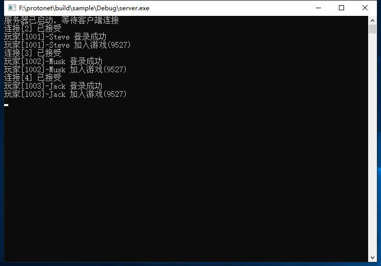
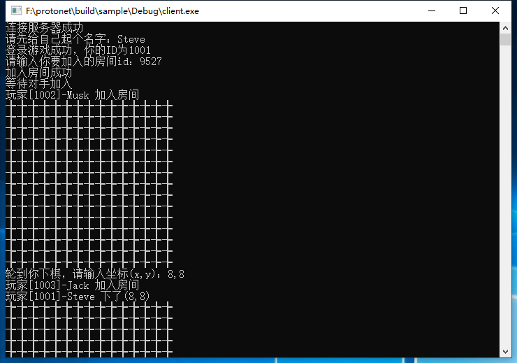
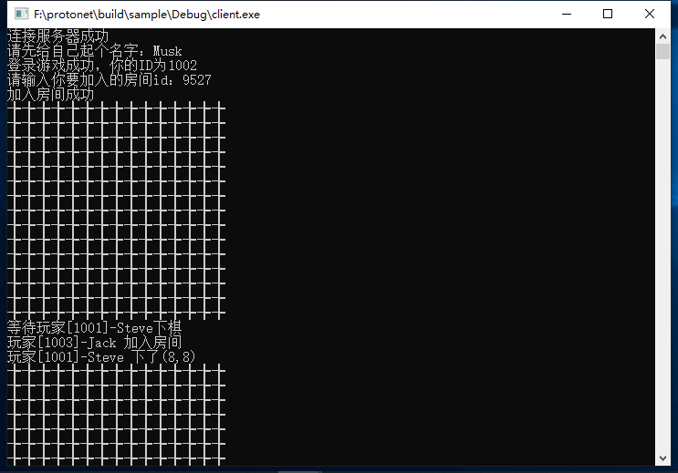
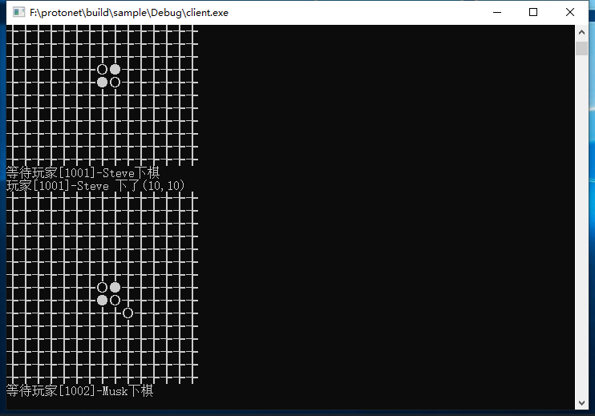

Protonet
===================================================

https://github.com/jinjiazhang/protonet/

## Overview
Cross Platform Network Frame for Client and Server<br>

## Interface
```C
struct iobuf
{
    int len;
    const void* data;
};

struct imanager
{
    virtual void on_accept(int netid, int error) = 0;
    virtual void on_closed(int netid, int error) = 0;
    virtual void on_package(int netid, char* data, int len) = 0;
};

struct inetwork
{
    virtual int update(int timeout) = 0;
    virtual int listen(imanager* manager, const char* ip, int port) = 0;
    virtual int connect(imanager* manager, const char* ip, int port) = 0;
    virtual void send(int netid, const void* data, int len) = 0;
    virtual void sendv(int netid, iobuf bufs[], int count) = 0;
    virtual void close(int netid) = 0;
    virtual void release() = 0;
};

inetwork* create_network();
```

## Sample
Gobang Online Game（五子棋联机游戏）




